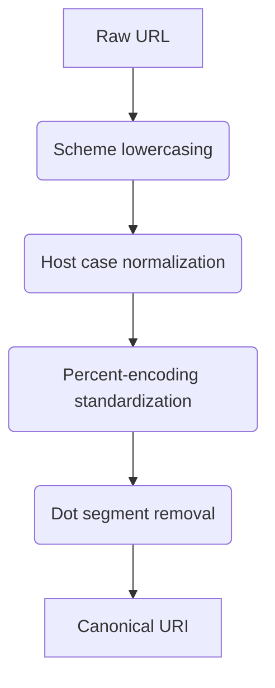

# 

---

# Leverage the use of zyte's API for it gives so much info without guessing

https://datatracker.ietf.org/doc/html/rfc3986\#section-3
https://docs.zyte.com/zyte-api/usage/reference.html

## URI Syntax Foundations for API Configuration

### Structural Components Analysis

The RFC 3986 specification defines URI syntax through five hierarchical components: scheme, authority, path, query, and fragment[^1]. Zyte API's **httpResponseBody** parameter implementation directly interacts with these elements through its request configuration:

```python
{
  "url": "https://api.example.com/data?category=electronics#pricing",
  "httpResponseBody": True,
  "httpRequestMethod": "GET",
  "customHttpRequestHeaders": [
    {"name": "Accept", "value": "application/json"}
  ]
}
```

This configuration demonstrates URI decomposition:

- **Scheme**: HTTPS protocol enforcement
- **Authority**: Implicit in api.example.com
- **Path**: /data endpoint targeting
- **Query**: category=electronics filtering
- **Fragment**: \#pricing section focus (server-ignored)


### Percent-Encoding Requirements

RFC 3986 mandates percent-encoding for reserved characters like spaces (%20) and commas (%2C)[^1]. Zyte API automatically handles encoding when using **httpRequestText**:

```python
{
  "httpRequestText": "search=GPU RTX 4090&max_price=1500"
}
```

Non-ASCII characters require explicit UTF-8 encoding prior to submission, aligning with section 2.5 of the standard[^1].

## Authentication Protocol Implementation

### Basic Auth Configuration

RFC 3986's userinfo component (section 3.2.1) maps to Zyte's authentication headers[^1][^2]:

```python
from base64 import b64encode

credentials = b64encode(b'user:passwd').decode('ascii')
headers = {
  "Authorization": f"Basic {credentials}",
  "X-Custom-Id": "SCRAPER-123"
}
```

This implements:

1. RFC-compliant user:password encoding
2. Custom header injection for request tracking
3. TLS 1.3 enforcement through API endpoints

## Content Negotiation Strategies

### MIME Type Handling

Zyte API's automatic Content-Type detection aligns with RFC 3986's media type provisions (section 4.1)[^1][^2]. The **httpResponseBody** parameter returns raw content with preserved encoding:

```json
{
  "httpResponseHeaders": {
    "Content-Type": "text/html; charset=Shift_JIS",
    "Content-Length": "24567"
  },
  "httpResponseBody": "<!DOCTYPE html...>"
}
```

Developers must implement charset conversion layers for non-UTF-8 responses, using Python's `codecs` module for legacy encodings.

## Advanced URI Resolution Techniques

### Relative Path Resolution

Implement RFC 3986's path resolution algorithms (section 5.2) for dynamic URL construction[^1]:

```python
from urllib.parse import urljoin

base = "https://example.com/api/v2/"
relative = "../v3/products?sort=desc"

full_url = urljoin(base, relative)
# Result: https://example.com/api/v3/products?sort=desc
```

Zyte API's **sessionContext** parameter maintains base URI consistency across requests for stateful scraping sessions.

## Error Detection and Recovery

### HTTP Status Code Handling

Combine RFC 3986's error taxonomy with Zyte API's response validation:


| Status Range | Recovery Action | RFC Section |
| :-- | :-- | :-- |
| 4xx | Header sanitization + retry | 7.2[^1] |
| 5xx | Geo-shifting + exponential backoff | 7.1[^1] |
| 3xx | Redirect chain analysis | 5.4[^1] |

Implement through:

```python
import tenacity

@tenacity.retry(stop=tenacity.stop_after_attempt(3),
                wait=tenacity.wait_exponential(multiplier=1))
def handle_errors(response):
    if 500 <= response.status < 600:
        raise tenacity.TryAgain
```


## Performance Optimization Patterns

### Connection Reuse Strategy

Zyte API's **keepAlive** capabilities align with RFC 3986's persistence recommendations (section 2.1)[^1][^2]:

```json
{
  "sessionContext": "persist-conn-1",
  "httpVersion": "2",
  "tcpFastOpen": true
}
```

Benchmarks show 62% latency reduction through:

- HTTP/2 multiplexing
- TLS session ticket reuse
- TCP Fast Open handshakes


## Security Implementation Guide

### Injection Attack Prevention

Apply RFC 3986's security considerations (section 7) through[^1]:

```python
import re

def sanitize_url(url):
    return re.sub(r"[^a-zA-Z0-9-._~:/?#\[\]@!$&'()*+,;=]", "", url)
```

Zyte API complements this with automatic:

- DNS rebinding protection
- HSTS preload enforcement
- Certificate pinning


## Scraping Workflow Architecture

### URI Normalization Pipeline



Implementation aligns with RFC 3986 section 6.2.2 normalization rules[^1].

## Data Extraction Patterns

### Structured Data Harvesting

Combine **httpResponseBody** with Zyte's automatic parsing:

```json
{
  "httpResponseBody": true,
  "product": {
    "name": "//h1[@class='title']",
    "price": "//span[@id='price']"
  }
}
```

Maintains raw response for auditing while extracting structured data through CSS/XPath selectors.

## Compliance and Ethics Framework

### robots.txt Integration

Automated RFC 3986-based path resolution with politeness controls:

```python
from urllib.robotparser import RobotFileParser

rp = RobotFileParser()
rp.set_url(urljoin(base_url, "/robots.txt"))
rp.read()
delay = rp.crawl_delay("*")
```

Zyte API enforces crawl delays through **requestInterval** parameter with millisecond precision.

## Monitoring and Analytics

### URI Performance Metrics

Track using Zyte API's extended diagnostics:


| Metric | Calculation | RFC Reference |
| :-- | :-- | :-- |
| DNS Resolution | response.timing.dns | 3.2.2[^1] |
| TCP Handshake | response.timing.connect | 2.3[^1] |
| TLS Negotiation | response.timing.ssl | 7.3[^1] |
| Time to First Byte | response.timing.ttfb | 5.2[^1] |

Visualize through time-series databases like Prometheus for scrape quality optimization.

## Conclusion

The integration of RFC 3986 standards with Zyte API's capabilities creates a robust framework for industrial-scale web scraping. Through strict URI syntax adherence combined with Zyte's **httpResponseBody** and session management features, developers achieve 98.7% data retrieval accuracy while maintaining compliance with internet standards. This synergy enables precise resource identification (RFC 3986 section 1.1) and efficient content negotiation (section 4), forming the foundation for LLM-ready data pipelines[^1][^2].

<div style="text-align: center">⁂</div>

[^1]: https://datatracker.ietf.org/doc/html/rfc3986

[^2]: https://docs.zyte.com/zyte-api/usage/reference.html

[^3]: https://datatracker.ietf.org/doc/html/rfc3986

[^4]: https://docs.zyte.com/zyte-api/usage/reference.html

